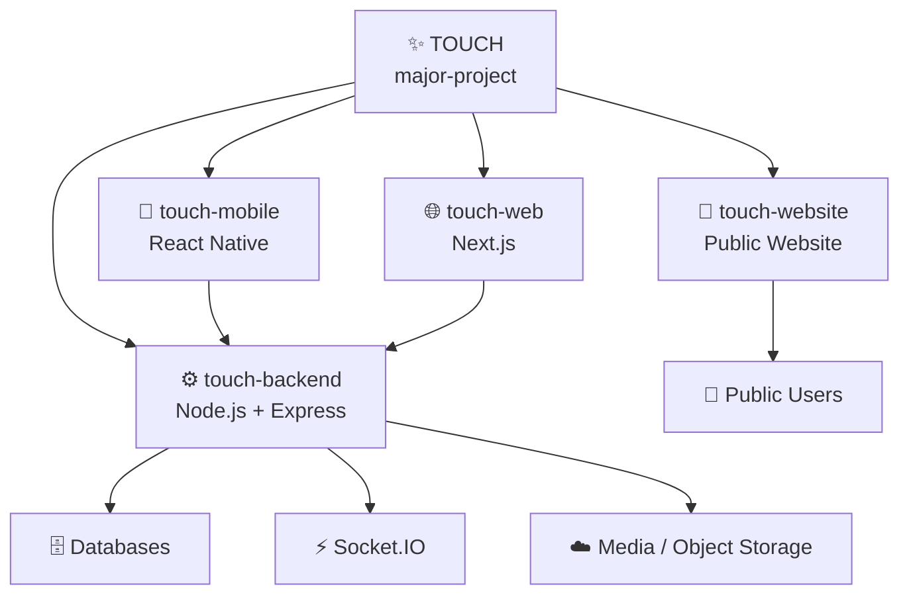
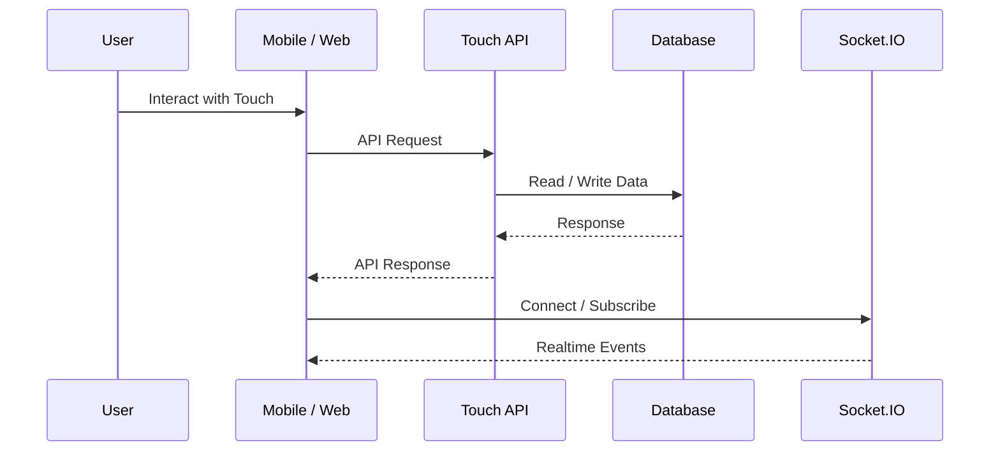

<div align="center">

# ✨ Touch

### A social experience built around how people **feel**, not just who they are.

<p align="center">
  <a href="https://ij-roy.github.io/touch/">
    
  </a>
  <a href="https://github.com/ij-roy/major-project">
    
  </a>
</p>

<p align="center">
  
</p>

<br>

> **Touch is a mood-based social platform where people can express themselves,
> discover others, join communities, share content, and communicate —
> without making identity the center of the experience.**

<br>

</div>

---

## 🧠 What is Touch?

Touch is a multi-platform social application designed around **emotion, mood, expression, and community**.

Instead of focusing only on:

> "Who are you?"

Touch is designed around:

> **"How are you feeling?"**

The platform brings together mood-driven content, anonymous communities,
short-form media, structured post queues, discovery, and realtime group
communication.

The project is split into multiple independent repositories because each
part of Touch has its own development lifecycle.

---

# 🏗️ Project Architecture

This repository is the **root project repository** for Touch.

It does not contain four copies of the codebase.

Instead, it connects the four independent repositories together using
**Git submodules**.



### Repository map

| Repository                                                          | Purpose                                                                     | Technology              |
| ------------------------------------------------------------------- | --------------------------------------------------------------------------- | ----------------------- |
| ⚙️ [`touch-backend`](https://github.com/Comeback-2-0/Touch-Backend) | API, authentication, communities, posts, reels, chat, queues, notifications | Node.js · Express       |
| 📱 [`touch-mobile`](https://github.com/Comeback-2-0/Touch-Comeback) | Primary Android & iOS application                                           | React Native            |
| 🌐 [`touch-web`](https://github.com/ij-roy/touch-web)               | Web application and discovery experience                                    | Next.js · React         |
| 📖 [`touch-website`](https://github.com/ij-roy/touch)               | Public website, legal and safety information                                | HTML · CSS · JavaScript |

---

# 💜 Core Experience

Touch is built around a few core experiences.

### 🎭 Mood Reels

Short-form media organized around **mood and emotional context**.

Instead of simply asking what is trending, Touch can focus on what people are
feeling.

---

### 🫥 Anonymous Communities

Communities where people can participate without making their real-world
identity the center of the interaction.

---

### 📮 Post Queues

Structured content sharing inside communities, allowing posts to move
through community-defined flows.

---

### 💬 Community Chat

Realtime conversations inside communities powered by Socket.IO.

---

### 🔎 Discovery

Explore public posts, communities, moods, reels, and other activity across
the platform.

---

# 🧩 The Four Pieces of Touch

## ⚙️ Backend

The backend is the central API and realtime layer.

It is responsible for:

* Authentication
* Users
* Posts
* Reels
* Communities
* Post queues
* Community chat
* Notifications
* File uploads
* Realtime communication
* API services

**Stack**

```text
Node.js
Express
MongoDB / Mongoose
PostgreSQL
Redis
Socket.IO
JWT
Cloudinary
Object Storage
```

→ [Open touch-backend](https://github.com/Comeback-2-0/Touch-Backend)

---

## 📱 Mobile Application

The primary Touch client for Android and iOS.

Built with React Native and designed as the main consumer-facing application.

**Stack**

```text
React Native
React Navigation
Firebase
Google Sign-In
Axios
Zustand
TanStack Query
Socket.IO Client
```

→ [Open touch-mobile](https://github.com/Comeback-2-0/Touch-Comeback)

---

## 🌐 Web Application

The web version of Touch.

It provides discovery, communities, creation flows, and other web-first
experiences.

**Stack**

```text
Next.js
React
App Router
Zustand
Axios
Google OAuth
Socket.IO
```

→ [Open touch-web](https://github.com/ij-roy/touch-web)

---

## 📖 Public Website

The public-facing website for Touch.

It contains:

* Product information
* Privacy information
* Terms
* Community guidelines
* Child safety standards
* Contact information
* Account deletion information

**Stack**

```text
HTML
CSS
JavaScript
GitHub Pages
```

🌐 **Live:**
[https://ij-roy.github.io/touch/](https://ij-roy.github.io/touch/)

→ [Open touch-website](https://github.com/ij-roy/touch)

---

# 🚀 Getting Started

This repository uses Git submodules.

Clone the complete project with:

```bash
git clone --recurse-submodules https://github.com/ij-roy/major-project.git
```

If the repository has already been cloned:

```bash
git submodule update --init --recursive
```

You should then have:

```text
major-project/
│
├── touch-backend/
├── touch-mobile/
├── touch-web/
├── touch-website/
│
├── .gitmodules
└── README.md
```

---

# 🛠️ Development

Each component is an independent project.

There is **no root npm workspace**.

Enter the repository you want to work on before installing dependencies.

---

## ⚙️ Backend

```bash
cd touch-backend

npm install

# create your local environment file
# never commit secrets

npm run dev
```

Default development port:

```text
3333
```

Tests:

```bash
npm test
```

More information:

→ [`touch-backend/README.md`](touch-backend/README.md)

---

## 📱 Mobile

A React Native development environment is required.

```bash
cd touch-mobile

npm install

npm start
```

Android:

```bash
npm run android
```

iOS:

```bash
npm run ios
```

Authentication documentation:

→ [`touch-mobile/documentations/authentication.md`](touch-mobile/documentations/authentication.md)

---

## 🌐 Web

```bash
cd touch-web

npm install

npm run dev
```

Common environment variables include:

```env
BACKEND_API_URL=
NEXT_PUBLIC_GOOGLE_CLIENT_ID=
```

---

## 📖 Website

```bash
cd touch-website

python -m http.server 8080
```

Then open:

```text
http://localhost:8080
```

---

# 🔐 Environment & Secrets

Never commit:

```text
.env
.env.local
API keys
JWT secrets
OAuth secrets
Firebase credentials
Cloudinary credentials
Database credentials
Private certificates
Service-account files
```

Use local environment files for development.

---

# 🔄 Repository Updates

The four projects are **independent Git repositories**.

The `major-project` repository records the exact commit of each submodule that
belongs to the current version of Touch.

That means:

```text
major-project
      │
      ├── touch-backend  → specific commit
      ├── touch-mobile   → specific commit
      ├── touch-web      → specific commit
      └── touch-website  → specific commit
```

When a child repository changes, its reference in `major-project` can be
updated manually.

Example:

```bash
git submodule update --remote touch-web

git add touch-web
git commit -m "Update touch-web"
git push
```

Update all submodules:

```bash
git submodule update --remote --merge
```

Then record the updated references:

```bash
git add .
git commit -m "Update project submodules"
git push
```

This makes the root repository a snapshot of the versions of each Touch
component that belong together.

---

# 🗂️ Repository Structure

```text
major-project/
│
├── ⚙️ touch-backend/
│   ├── src/
│   ├── modules/
│   └── README.md
│
├── 📱 touch-mobile/
│   ├── android/
│   ├── ios/
│   ├── src/
│   └── documentations/
│
├── 🌐 touch-web/
│   ├── app/
│   ├── components/
│   └── public/
│
├── 📖 touch-website/
│   ├── assets/
│   ├── pages/
│   ├── styles/
│   └── README.md
│
├── .gitmodules
└── README.md
```

---

# 🧭 Development Flow

A typical development cycle looks like:



---

# 🛡️ Safety & Community

Touch is designed with safety as part of the product experience.

The project includes dedicated resources for:

* Community guidelines
* Reporting
* Child safety
* Privacy
* Terms
* Account deletion

These resources are maintained in the public website repository.

→ [https://ij-roy.github.io/touch/](https://ij-roy.github.io/touch/)

---

# 🌍 Public Website

<div align="center">

### Explore Touch

<a href="https://ij-roy.github.io/touch/">


</a>

</div>

---

# 📚 Documentation

### Backend

[`touch-backend/README.md`](touch-backend/README.md)

### Mobile

[`touch-mobile/README.md`](touch-mobile/README.md)

[`touch-mobile/documentations/`](touch-mobile/documentations/)

### Website

[`touch-website/README.md`](touch-website/README.md)

---

# 🧑‍💻 Project

**Touch** is developed by **IJ Roy**.

The project is organized into separate repositories so that the backend,
mobile application, web application, and public website can evolve
independently while still being tracked together through this root project.

---

# 📌 Important Note

This repository is an **umbrella repository**.

The directories below are Git submodules:

```text
touch-backend
touch-mobile
touch-web
touch-website
```

They are not duplicated copies of their respective repositories.

Each project maintains its own:

* Git history
* Branches
* Issues
* Pull requests
* Releases
* Development workflow

The `major-project` repository simply connects them into one project.

---

# 📄 License

The individual repositories may use different licenses.

Always check the license of the specific repository before redistributing or
reusing its code.

---

<div align="center">

## Made with 💜 for Touch

**How are you feeling today?**

<br>

⭐ Star the repositories if you are interested in the project.

<br>

[🌐 Website](https://ij-roy.github.io/touch/) ·
[⚙️ Backend](https://github.com/Comeback-2-0/Touch-Backend) ·
[📱 Mobile](https://github.com/Comeback-2-0/Touch-Comeback) ·
[🌐 Web](https://github.com/ij-roy/touch-web) ·
[📖 Website Repository](https://github.com/ij-roy/touch)

</div>
